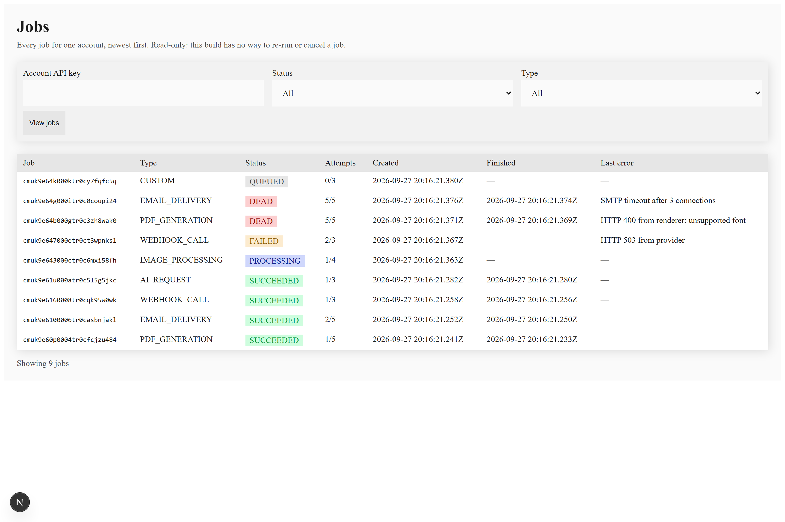
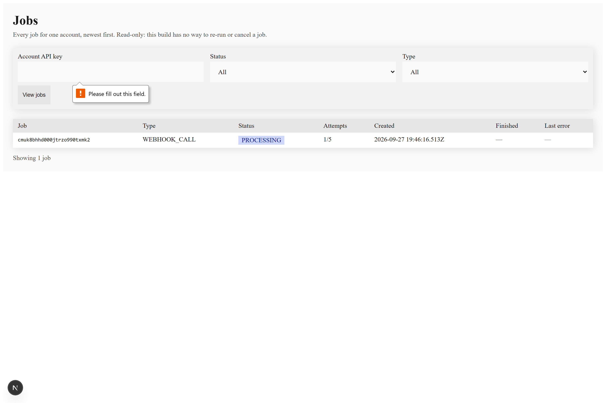
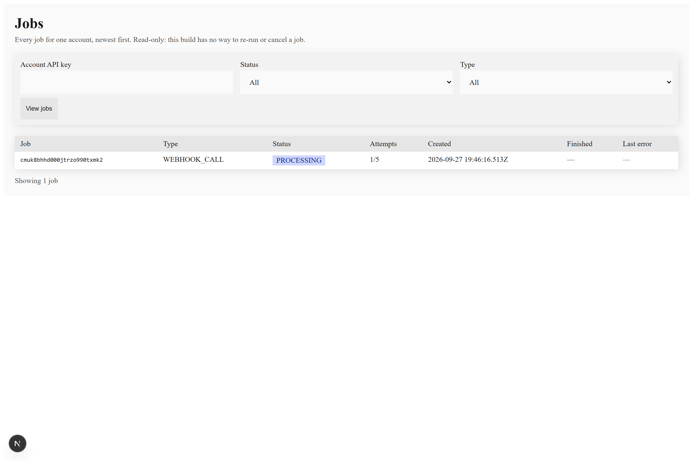
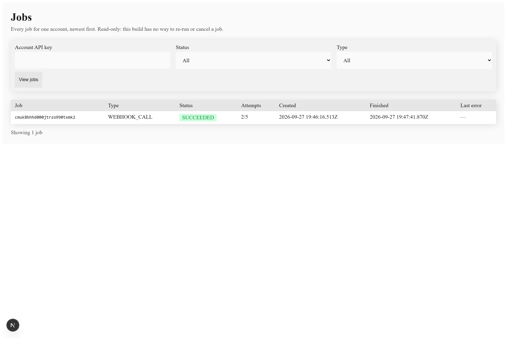
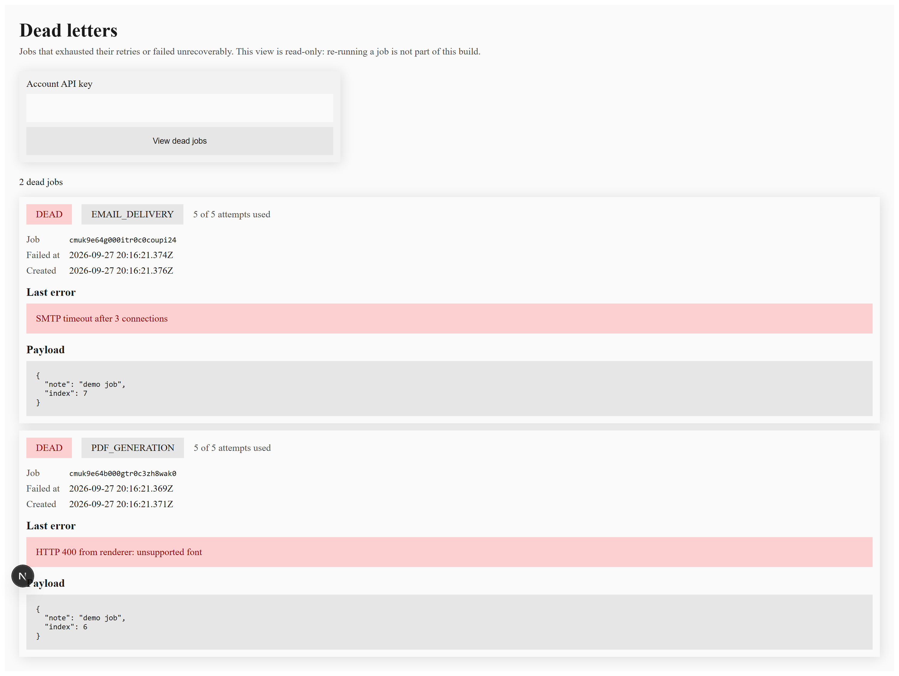

# RenderFlow — v1 Evidence

Verification record for the v1 job pipeline. Every claim below is either backed by
captured command output (verbatim, in a fenced block) or by a screenshot the
reader is expected to open in ``.

Screenshots are the only outstanding items. Each one has a placeholder naming the
exact file to save and what must be visible in it.

**How to reproduce everything**

```bash
npm run db:migrate          # PostgreSQL must be reachable; see .env
npm run build
npm run test:integration    # 88 DB-backed tests
npm test                    # 83 unit tests
node scripts/step9/run-scenarios.js   # 5 adversarial scenarios, writes .step9-run.log
```

---

## Evidence index

| # | Claim | Requirement | Artifact |
|---|-------|-------------|----------|
| 1 | Jobs table shows all five statuses | `PR-JOB-004`, `PR-JOB-005` | [§1](#1-jobs-table-all-five-statuses) — screenshot |
| 2 | Backoff delays grow between attempts | `PR-RETRY-004` | [§2](#2-backoff-delays-grow-between-attempts) — log ✅ |
| 3 | Concurrency cap holds under 50 jobs | `PR-QUEUE-004` | [§3](#3-concurrency-cap-holds-under-50-jobs) — log ✅ |
| 4 | Stuck-job recovery after a kill | `PR-RETRY-003`, `PR-QUEUE-005` | [§4](#4-stuck-job-recovery) — log ✅ + 3 screenshots |
| 5 | Dead-letter view with a job in it | `PR-OBS-001` | [§5](#5-dead-letter-view) — screenshot |
| 6 | Idempotent replay / payload conflict | `PR-IDEM-002` | [§6](#6-idempotency) — log ✅ |
| 7 | Two workers never double-execute | `PR-TECH-002`, `PR-QUEUE-001` | [§7](#7-two-workers) — log ✅ |

---

## 1. Jobs table, all five statuses

**Proves** — `PR-JOB-004` (job status readable) and `PR-JOB-005` (list endpoint with
filters and cursor pagination) surface every lifecycle state through the API and
the operator screen.

**Setup**

```bash
npm run seed-demo      # creates an account with 9 jobs across all 5 statuses
npm run dev            # http://localhost:3001
```

`seed-demo` prints the API key once. The seeded set is:

```
status counts: {"SUCCEEDED":4,"PROCESSING":1,"FAILED":1,"DEAD":2,"QUEUED":1}
  SUCCEEDED  PDF_GENERATION     1/5
  SUCCEEDED  EMAIL_DELIVERY     2/5
  SUCCEEDED  WEBHOOK_CALL       1/3
  SUCCEEDED  AI_REQUEST         1/3
  PROCESSING IMAGE_PROCESSING   1/4
  FAILED     WEBHOOK_CALL       2/3
  DEAD       PDF_GENERATION     5/5
  DEAD       EMAIL_DELIVERY     5/5
  QUEUED     CUSTOM             0/3
```

**Screenshot captured** — `01-jobs-table.png`

> Must show, in one frame: the page heading, the account API key field, the status
> filter, and table rows covering **all five** of `QUEUED`, `PROCESSING`,
> `SUCCEEDED`, `FAILED`, `DEAD`.
>
> Do not start a worker before capturing this. A worker will claim the `QUEUED` and
> `PROCESSING` rows and change their status.



---

## 2. Backoff delays grow between attempts

**Proves** — `PR-RETRY-004` / `PR-RETRY-001`: a failing job waits progressively
longer between attempts, and is finished as `DEAD` when attempts are exhausted.

**Reproduce** — `node scripts/step9/run-scenarios.js 2` (single job, target always
returns 500).

**Captured output** — verbatim from `.step9-s2b.log`

```
Adopting scenario 2 job cmuk4sden0001trlghohfqaxe (status=FAILED, attempts=4/5)
Worker starting with concurrency 10
Claimable job types: WEBHOOK_CALL
Heartbeat every 500ms; sweeping every 500ms for heartbeats stale past 3000ms
Concurrency high-water mark: 1 of 10
Job cmuk4sden0001trlghohfqaxe attempt 5/5 failed -> DEAD (NETWORK_ERROR)

  final status      : DEAD
  attempts          : 5/5 (rows=5)
  every attempt lost: true
  last error        : fetch failed
  backoff gaps between attempts (s):
    after attempt 1: 42.95s
    after attempt 2: 69.51s
    after attempt 3: 133.40s
    after attempt 4: 297.01s
  monotonically increasing: true

  PASS  100% failure rate retries to DEAD
```

**What to check** — each gap is larger than the one before it
(42.95 < 69.51 < 133.40 < 297.01), the final status is `DEAD`, and there are
exactly 5 attempt rows for 5 attempts (no attempt record was overwritten).

**Note on the last attempt** — attempt 5 reports `NETWORK_ERROR` rather than
`HTTP_500` because the harness had already shut its target server down when the
resumed run picked up the job. The backoff and terminal-state proof is unaffected;
the attempt still failed and still exhausted the budget.

### Absolute attempt timestamps

The gaps above are elapsed times, so they show *that* the delay grew but not
*when* the attempts ran. This table has the clock times, and it comes from a
separate live run — the job above no longer exists in the database. The seeded
`DEAD` jobs in the demo account are deliberately **not** used here: they are
inserted with hand-written timestamps by `npm run seed-demo`, so quoting them
would present fiction as measurement.

Job `cmuk8epnx000ltrzoq5el01zb`, one `JobAttempt` row per attempt, read straight
from the database. Reproduce with `node evidence/scripts/report-backoff.cjs`.

| Attempt | Outcome | Error | Started (UTC) | Finished (UTC) | Duration | Waited before this attempt | Expected band |
| --- | --- | --- | --- | --- | --- | --- | --- |
| 1 | FAILED | HTTP_500 | 2026-09-27T19:48:47.273Z | 2026-09-27T19:48:47.339Z | 66ms | - | - |
| 2 | FAILED | HTTP_500 | 2026-09-27T19:49:22.468Z | 2026-09-27T19:49:22.479Z | 11ms | 35.13s | 30-45s |
| 3 | FAILED | HTTP_500 | 2026-09-27T19:50:28.291Z | 2026-09-27T19:50:28.305Z | 14ms | 65.81s | 60-90s |
| 4 | FAILED | HTTP_500 | 2026-09-27T19:52:29.615Z | 2026-09-27T19:52:29.625Z | 10ms | 121.31s | 120-180s |
| 5 | FAILED | HTTP_500 | 2026-09-27T20:14:01.797Z | 2026-09-27T20:14:01.972Z | 175ms | 1292.17s | 240-360s **off-band** |

The expected band is computed by calling the real `backoffDelayMs` from
`modules/retry/backoff.ts` with jitter pinned to its minimum and its maximum, so
the report cannot drift from the policy it is checking. Waits 2, 3 and 4 land
inside the band, which is what demonstrates the ladder *and* that jitter varies
(35.13s, 65.81s and 121.31s sit at 17%, 10% and 1% above their base terms).

**The off-band wait is reported, not folded in.** Wait 4 → 5 is 1292.17s where
the policy allows at most 360s. The policy is fixed in code, so the extra ~950s
is time the schedule did not control: that capture's worker exited while the job
was waiting, and the job sat in `FAILED` until a worker was restarted to pick it
up. It measures downtime, not backoff, and is called out here rather than used to
make the ladder look larger than it is. Full generated report:
`logs/backoff-timestamps.md`.

---

## 3. Concurrency cap holds under 50 jobs

**Proves** — `PR-QUEUE-004`: the per-process cap of 10 is never exceeded, and 50
submitted jobs are executed exactly once each.

**Reproduce** — `node scripts/step9/run-scenarios.js 1` (50 jobs submitted, two
independent counters observe the limit: the worker logs its own in-flight count,
and the target server counts simultaneous inbound requests).

**Captured output** — verbatim from `.step9-run.log`

```
  [w1] Concurrency high-water mark: 1 of 10
  [w1] Concurrency high-water mark: 2 of 10
Concurrency high-water mark: 3 of 10
  [w1] Concurrency high-water mark: 4 of 10
  [w1] Concurrency high-water mark: 5 of 10
  [w1] Concurrency high-water mark: 6 of 10
  [w1] Concurrency high-water mark: 7 of 10
  [w1] Concurrency high-water mark: 8 of 10
  [w1] Concurrency high-water mark: 9 of 10
  [w1] Concurrency high-water mark: 10 of 10
  PASS  50 jobs, peak concurrency <= 10
        target peak simultaneous requests=10 (cap 10); worker high-water mark=10/10; 50/50 SUCCEEDED; total attempts=50 (50 means no job ran twice)
```

**What to check** — the target observed a peak of 10 simultaneous requests against
a cap of 10, so the limit bound the work rather than being incidental. Total
attempts equal the number of jobs (50 = 50), so no job was executed twice.

---

## 4. Stuck-job recovery

**Proves** — `PR-RETRY-003` / `PR-QUEUE-005`: recovery is driven by a **stale
heartbeat**, not by elapsed claim time, and a recovered job is executed exactly
once more — not twice.

**Reproduce** — `node scripts/step9/run-scenarios.js 3` (two sub-cases: a slow but
heartbeating job, then a worker killed with `SIGKILL`).

**Captured output** — verbatim from `.step9-run.log`

```
  PASS  a slow but heartbeating job is never requeued
        after 6s in flight (>3x the 3s stall timeout) status=PROCESSING, target hits=1; final status=SUCCEEDED, attempts=1, total target hits=1 (1 means executed exactly once)
  [w3-doomed] Concurrency high-water mark: 1 of 10
  [w3-recovery] Concurrency high-water mark: 1 of 10
  PASS  killed worker's job is recovered once
        at kill time status=PROCESSING attempts=1; after SIGKILL status=PROCESSING (left PROCESSING, awaiting staleness); final status=SUCCEEDED attempts=2; attempt rows=2; target hits=2 (2 = the killed attempt plus exactly one recovery, not a double run)
```

**What to check** — sub-case A is the important one. The job ran for 6 seconds
against a 3-second stall timeout, i.e. more than twice the timeout, and was
**not** requeued, because its heartbeat kept arriving. That is the rule that
prevents duplicate emails and duplicate outbound calls on legitimately slow work.
Sub-case B shows the opposite path: a genuinely dead worker's job is recovered,
and `attempts=2` with `target hits=2` means killed-attempt-plus-one-recovery, not
a double execution.

**Screenshots captured** — three, in order:

| File | Moment to capture | Must show |
|------|-------------------|-----------|
| `04a-before-kill.png` | While the doomed job is in flight | Job row with status `PROCESSING`, `attempts = 1` |
| `04b-after-kill.png` | Immediately after `SIGKILL`, before the sweep recovers it | Job row still `PROCESSING`, `attempts` still `1` — left behind, not yet reclaimed |
| `04c-after-recovery.png` | After the sweep and the recovery run | Job row `SUCCEEDED`, `attempts = 2` |





The dashboard at `/jobs` can serve all three, but the `PROCESSING` window is
short in the default configuration. To widen it, raise the stall timeout and lower
the heartbeat interval so the gap is easy to photograph:

```bash
HEARTBEAT_INTERVAL_MS=20000 STALL_TIMEOUT_MS=60000 npm run worker
```

Then submit one `WEBHOOK_CALL` job against a slow target, capture 04a, kill the
worker, capture 04b, wait for the sweep, capture 04c.

---

## 5. Dead-letter view

**Proves** — `PR-OBS-001`: jobs that exhausted their retries are visible to an
operator. `DEAD` is the owner-directed terminal state; under the PRD's earlier
four-status model this was `FAILED`.

**Setup** — the `seed-demo` account contains two `DEAD` jobs (`PDF_GENERATION` at
5/5 attempts, `EMAIL_DELIVERY` at 5/5).

```bash
npm run dev     # then open http://localhost:3001/dead-letters
```

**Screenshot captured** — `05-dead-letters.png`

> Must show the `/dead-letters` page with at least one job card visible,
> including its `DEAD` badge, the "N of M attempts used" line, and the last-error
> text.
>
> The demo `PDF_GENERATION` job's error is
> `HTTP 400 from renderer: unsupported font`, which is a good choice because it
> shows a genuine terminal cause rather than a generic network error.



---

## 6. Idempotency

**Proves** — `PR-IDEM-002`: a replayed key returns the same job, and a reused key
with a different payload is a `409`.

**Captured output** — verbatim from `.step9-run.log`

```
  PASS  replayed idempotency key returns the same job; a changed payload is 409
```

Observed behaviour: first submission `202` with job id A; replay `200` with the
same id A and exactly one row in the database; changed payload on the same key
`409` with no second row created.

---

## 7. Two workers, exactly-once claim

**Proves** — `PR-TECH-002` and `PR-QUEUE-001`: claiming is a single atomic
transaction, so even two concurrent workers never execute one job twice.

**Reproduce** — `node scripts/step9/run-scenarios.js 5` (20 jobs, two worker
processes).

**Captured output** — verbatim from `.step9-run.log`

```
  PASS  two workers, every job claimed exactly once
        20/20 SUCCEEDED; jobs with attempts != 1: 0; jobs whose target saw a request count other than 1: 0 (distribution 1,1,1,1,1,1,1,1,1,1,1,1,1,1,1,1,1,1,1,1)
```

**What to check** — the distribution is twenty `1`s. Every job was seen by the
target exactly once, and no job recorded more than one attempt.

---

## Test suite totals

Captured at the time of writing:

```
npm test                    -> tests 83, pass 83, fail 0
npm run test:integration    -> tests 88, pass 88, fail 0
npm run typecheck           -> clean
npm run lint                -> 0 errors, 1 warning (pre-existing next/font false positive)
npm run build               -> success
```

## Raw logs

| File | Contents |
|------|----------|
| `logs/scenario-1-3-4-5.log` | Scenarios 1, 3, 4, 5 and the first three attempts of scenario 2 |
| `logs/scenario-2-attempts-1-4.log` | Scenario 2, attempts 1–4 |
| `logs/scenario-2-attempt-5-verdict.log` | Scenario 2 resumed, attempt 5 and the final verdict |
| `logs/stuck-recovery-capture.log` | Worker A in flight, the kill, the sweep, worker B, and the two-attempt timeline |
| `logs/backoff-capture.log` | A live job walking the retry ladder to `DEAD` |
| `logs/backoff-timestamps.md` | Absolute attempt timestamps for that job, read from `JobAttempt` |
| `frames.json` | The exact table text each screenshot was taken with, so an image can be checked without opening it |

Scenario 2 was split across two runs because the terminal session running the
harness was interrupted. The job was adopted rather than restarted, so the backoff
gaps in §2 span a real gap in wall-clock time across both runs.

## Known gaps in this evidence

- Scenario 2's fifth attempt records `NETWORK_ERROR` instead of `HTTP_500`; see the
  note in §2. The backoff ladder and the `DEAD` outcome are still demonstrated.
- Scenario 2's job no longer exists in the database, so §2's absolute timestamps
  come from a separate live run rather than from the log excerpt above. The seeded
  `DEAD` jobs in the demo account are **not** used as backoff evidence: they are
  inserted with hand-written timestamps by `npm run seed-demo`, so quoting them
  would present fiction as measurement.

---

## Delivery semantics (the "idempotent work" decision)

RenderFlow's guarantee is **at-least-once execution with receiver-side dedupe**,
not exactly-once side effects. Stated precisely:

- One row per `(accountId, idempotencyKey)`, enforced by a database unique
  constraint rather than application code, so a replayed submission cannot create
  a second job.
- A job is never executed by two workers at the same time; claiming is a single
  atomic transaction.
- A job **is** re-executed after a crash, a stall recovery, or a retry. That is
  inherent to at-least-once delivery and cannot be removed without idempotent
  executors, which v1 does not have for the deferred job types.
- What the platform guarantees is that a repeat is *harmless to detect*: every
  attempt carries a stable `Idempotency-Key` set to the job id — not the attempt
  number, so it is unchanged across retries — and a caller-supplied
  `Idempotency-Key` is rejected rather than honoured
  (`worker/executors/webhook-call.ts:173-183`).

The consequence for a caller is that the receiving endpoint must collapse repeats
on that key. RenderFlow will not silently double-deliver, and it will not
pretend a retry is safe for a receiver that ignores the header.

## Dead-letter manual retry (the scope decision)

The dead-letter **view** ships in v1. **Manual retry does not**, and that is
deliberate rather than an omission: dead-letter replay tooling is placed in v2 by
PRD Section 13, and AGENTS rule 22 forbids building a later-phase item early
while v1 is still in progress. Building it now would also require deciding
undefined behaviour — whether replay resets the attempt counter, what
`maxAttempts` becomes, whether the original failure is preserved, and who is
authorised to trigger it — none of which the PRD defines.

The view is deliberately read-only and says so on screen, so an operator is never
led to believe a recovery action exists.
